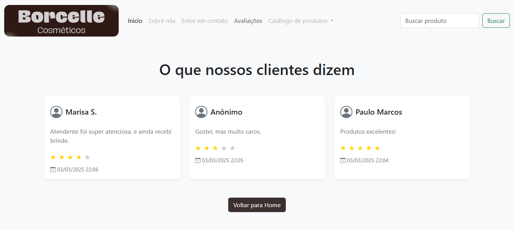

# 🛍️ Borcelle - A Beauty Store with Reviews System 💖✨




Welcome to **Borcelle**, a fictional beauty store built with Django! 🎉 This is my very first Django project, where I explored the framework while working on something I love: **makeup and beauty products!** 💄💅

## 🌟 Project Overview

The main feature of this project is the **review system**, where users can leave their feedback with:

- 📝 Their name
- 💬 A review text
- ⭐ A rating (1-5 stars)

You can check out all the reviews by navigating to `/reviews`! 🏆

However, due to the limitations of **Vercel's free hosting**, the database is **not functional on deployment** 😔. But don’t worry—you can clone this project and run it locally! 🚀

🔗 **Live Demo:** [Borcelle on Vercel](https://lady-borcelle.vercel.app/)

## 🛠️ Technologies Used

- **Python** 🐍
- **Django** 🌍
- **SQLite** 🗃️
- **HTML & CSS** 🎨
- **Bootstrap** 🚀
- **Artificial Intelligence (Grok)** 🤖 (50% of the images were AI-generated, and the other 50% were created by me!)

## 📚 Learning Resources

I followed these amazing tutorials while building this project. A huge thank you to these content creators! 🙌

🎥 **Video by Jhonathan de Souza (Dev Aprender):** [Watch Here](https://youtu.be/-m5ywU8SW9E?si=94FpV3tiDKyoxt_C)

📜 **Tutorial by Joshyvibe:** [Check it Out](https://youtu.be/fgoP_UqvoSo?si=OefmiesHQKwFJv7t)

## 👩‍💻 About the Developer

Hi, I'm **Jessie M. Bentes**, a passionate developer exploring Django! 🚀👩‍💻


## 🏡 Running the Project Locally

Since the database doesn't work on Vercel, follow these steps to clone and run it locally:

### 📥 Clone the Repository

```sh
git clone https://github.com/LadyJessie19/my-first-django
cd my-first-django
```

### 🏗️ Create a Virtual Environment

```sh
python -m venv venv
source venv/bin/activate  # On Windows: venv\Scripts\activate
```

### 📦 Install Dependencies

```sh
pip install -r requirements.txt
```

### 🔨 Apply Migrations

```sh
python manage.py migrate
```

### 👤 Create a Superuser (Optional, for Admin Access)

```sh
python manage.py createsuperuser
```

### 🚀 Run the Server

```sh
python manage.py runserver
```

Now, open **http://127.0.0.1:8000/** in your browser and enjoy! 🎉

## 💡 Want to Contribute?

Feel free to submit **issues, pull requests, or suggestions**! 😊

- If you find any bugs 🐞, report them!
- Have an idea? 💡 Let's make it happen!

## 📜 License

This project is licensed under the **MIT License**. 📝

---

💖 Thank you for checking out **Borcelle**! I hope you like it as much as I enjoyed building it! 🚀💋
